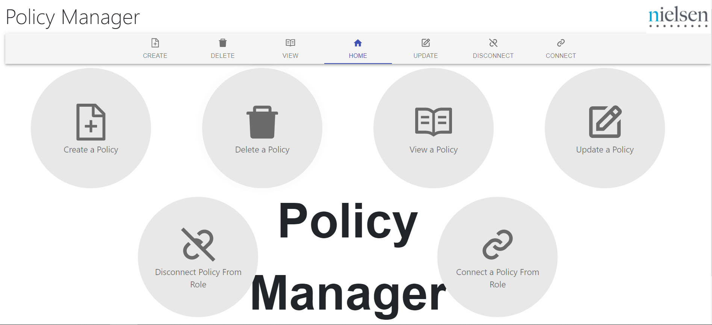
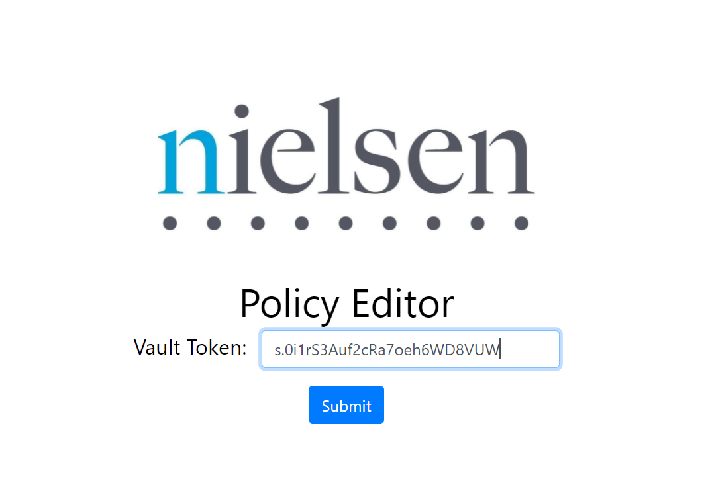
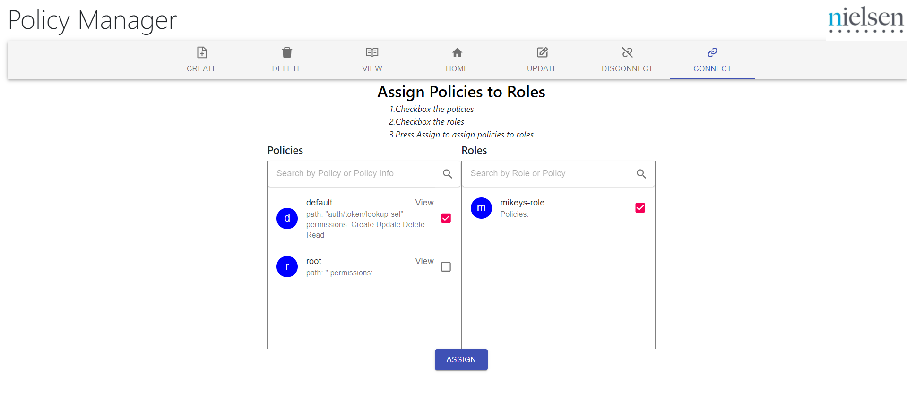
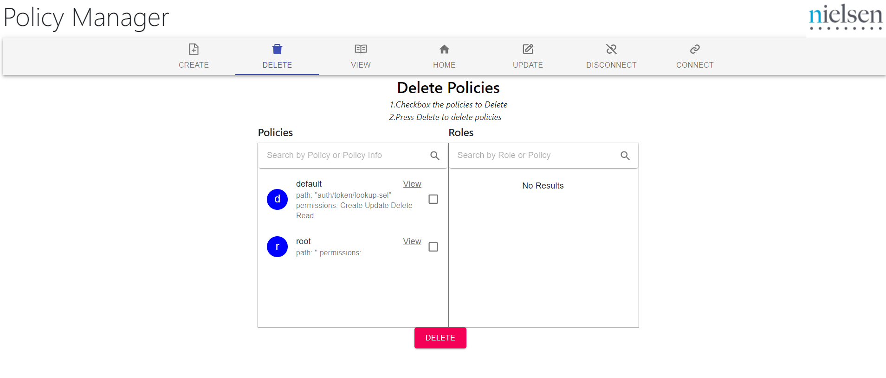

# Nielsen Internship - React, Flask, Hashicorp Vault, Kubernetes, Helm




## Purpose
This project was intended to be a Policy Manager. In Vault, there are policies for each user role, and these policies consist of secrets and private information that will be assigned to user roles. At Nielsen, they wanted a gui to communicate with the vault at gitlab. Through gitlab authentication under okta or as a human user providing policies to roles manually, this project was meant to use that authentication to CRUD a policy or assign/remove policies from roles. 

## Overview
As a prototype, I had Hashicorp Vault server to store the secrets,policies, and roles. Then, I created a Flask API to communicate with the vault to get,post, and delete policy/auth information. Along with the Flask API, I had unit tests(all contained in the /api (more information on running these tests below)). Next, I created a React front-end that served as the gui and would proxy requests to the api. To streamline the build process, I contstructed a docker compose file in order to create a docker local network for these channels to communicate with each other. Scaling the project, I incorporated kubernetes with helm to have deployments ready for the client and server. By incorporating vault agent, I automated authentication and made a vault injector to cache my tokens.

## Setup for Running Prototype

We will now make a docker network. Inside, we have a client, api, and vault. In the project directory, you can run:

### `docker compose up`

Runs the app in the development mode.\
Open [http://localhost:3000](http://localhost:3000) to view it in the browser.

## Setup for Running API tests

In the project directory, we need to setup the testing environment:

### `docker compose --project-directory ./api up`

Now run the test cases:

### `python ./api/PythonAPITests.py`

## Setup for Running on Kubernetes Cluster

First setup a simple cluster, like minikube. You must install kubectl, minikube, and helm3
### `minikube start`

In the project directory, create your 3 deployments(client, api, Hashicorp Vault) You can reuse these commands to issue project updates. The helm charts are configured to retrieve the client/api images from the gitlab registry, which is why we have this secret.

### `kubectl create secret docker-registry gitlab-access-token --docker-server=registry.gitlab.com --docker-username=nmcci --docker-password TxMX2psxzXMh_inkZ-9M`
### `helm upgrade --install api vaulthelm --values vaulthelm/api.yaml`
### `helm upgrade --install client vaulthelm --values vaulthelm/client.yaml`
### `helm upgrade --install vault vaulthelm --values vaulthelm/vault.yaml`

To access the client after placing all three images on the cluster.This will tunnel into the cluster to open a port that's accessible via link

### `minikube service client --url`
```
* service default/client has no node port
* Starting tunnel for service client.
|-----------|--------|-------------|------------------------|
| NAMESPACE |  NAME  | TARGET PORT |          URL           |
|-----------|--------|-------------|------------------------|
| default   | client |             | http://127.0.0.1:52040 |
|-----------|--------|-------------|------------------------|
http://127.0.0.1:52040
```

To login into the client first view the pods running

### `kubectl get pods`
```
NAME                      READY   STATUS              RESTARTS   AGE
api-5dc7b85fdc-ggnf5      1/1     Running             0          19m
api-5dc7b85fdc-xt5zb      1/1     Running             0          25m
api-5dc7b85fdc-ztbkd      1/1     Running             0          19m
client-6cc9b5dd4f-lh7lx   1/1     Running             0          21m
client-6cc9b5dd4f-ngwn9   1/1     Running             0          21m
client-6cc9b5dd4f-qzvp8   1/1     Running             0          24m
vault-6f7d665bd9-fb8pw    1/1     Running             0          20m
```

Copy the vault pod. We will view the logs to find the root token. The root token will be toward the bottom of the logs, labeled Root-Token. You can now copy that token and paste it the client login. Don't include quotations in the token.

### `kubectl logs vault-6f7d665bd9-fb8pw`
```
...
The unseal key and root token are displayed below in case you want to
seal/unseal the Vault or re-authenticate.

Unseal Key: P+mrGTOz7eq3tP/I5OruwhxqI03PqlSv6AyqupOuQiE=
Root Token: s.0i1rS3Auf2cRa7oeh6WD8VUW

Development mode should NOT be used in production installations!
```



## Example Images




