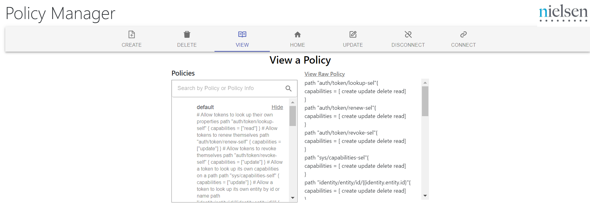

# Nielsen Internship - React, Flask, Hashicorp Vault

## Purpose
This project was intended to be a Policy Manager. In Vault, there are policies for each user role, and these policies consist of secrets and private information that will be assigned to user roles. At Nielsen, they wanted a gui to communicate with the vault at gitlab. Through gitlab authentication under okta or as a human user providing policies to roles manually, this project was meant to use that authentication to CRUD a policy or assign/remove policies from roles. 

## Overview
As a prototype, I had Hashicorp Vault server to store the secrets,policies, and roles. Then, I created a Flask API to communicate with the vault to get,post, and delete policy/auth information. Along with the Flask API, I had unit tests(all contained in the /api (more information on running these tests below)). Next, I created a React front-end that served as the gui and would proxy requests to the api. To streamline the build process, I contstructed a docker compose file.

## Setup for Running Prototype

We will now make a docker network. Inside, we have a client, api, and vault. In the project directory, you can run:

### `docker compose up`

Runs the app in the development mode.\
Open [http://localhost:3000](http://localhost:3000) to view it in the browser.

## Setup for Running API tests

In the project directory, we need to setup the testing environment:

### `docker compose --project-directory ./api up`

Now run the test cases:

### `python ./api/PythonAPITests.py`

## Example Images

